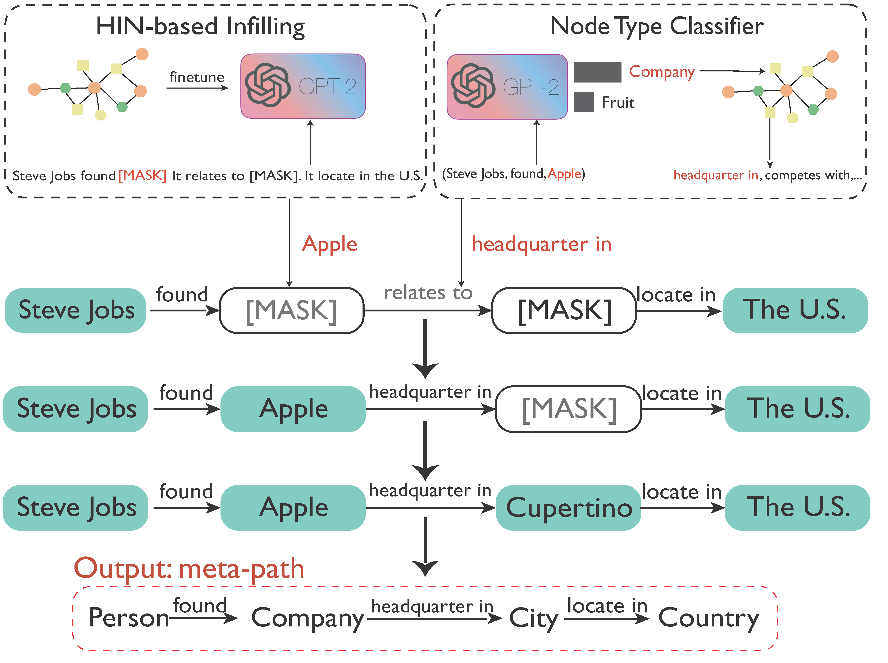

This is the implementation of our EMNLP 2022 paper:

**MetaFill: Text Infilling for Meta-Path Generation on Heterogeneous Information Networks**. 

Please cite our paper when you use this code in your work.

## Framework

## Dependency

```console
❱❱❱ pip install -r requirements.txt
```

## Use our finetuned GPT-2

If you want to quickly generate metapaths with our model, please put the files in [**pretrained_models**](https://drive.google.com/file/d/1-rn6HsHmVFooclFK3bNDFbgDTUmTYySA/view?usp=sharing) in this directory and run the generation script ```gen_metapath.sh``` .  The k-hop meta-paths and their scores will be stored in ```meta_path_ft_heterographine_k.txt```.

## Finetune the GPT-2 yourself

### Data preparation

Generate the masked data for finetuning GPT-2 for text infilling:

```console
❱❱❱ python mask_data.py

```
### Finetuning GPT-2 for text infilling

1. Follow the paper "Enabling language models to fill in the blanks"[<sup>1</sup>](#ilm) to set the environment, and put their finetuned model on arxiv abstracts under ```abs_ilm```.

2. ```train.sh```  is the script for finetuning the GPT-2 on HeteroGraphine.


### Node Type Classifier Training

```train_classifier.sh```  is the script for training the node type classifier for HeteroGraphine.

### Meta-Path Generation

**Remove the "--from-pretrained"** in ```gen_metapath.sh``` and run it. 

## Acknowledgement

We use the open-source code of "Enabling language models to fill in the blanks"[<sup>1</sup>](#ilm) to finetune the GPT-2 for text infilling

<div id="ilm"></div>

- [1] Donahue C, Lee M, Liang P. Enabling Language Models to Fill in the Blanks[C]//Proceedings of the 58th Annual Meeting of the Association for Computational Linguistics. 2020: 2492-2501.
